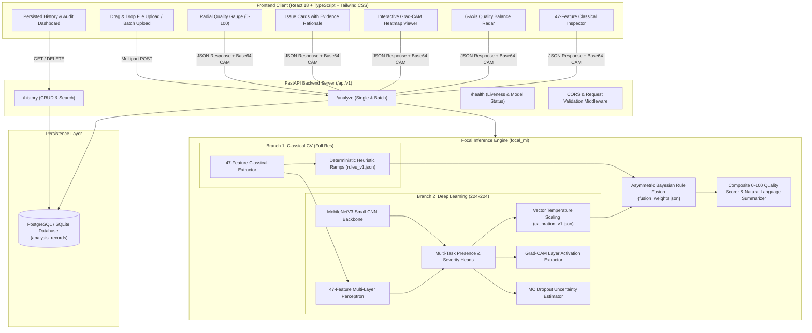
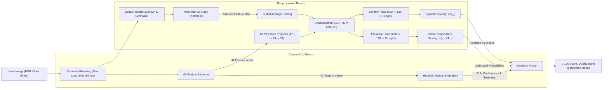
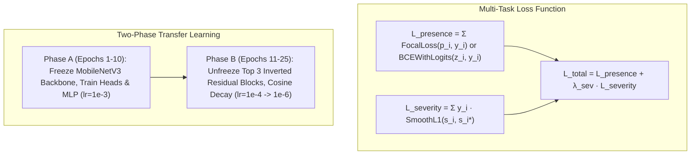
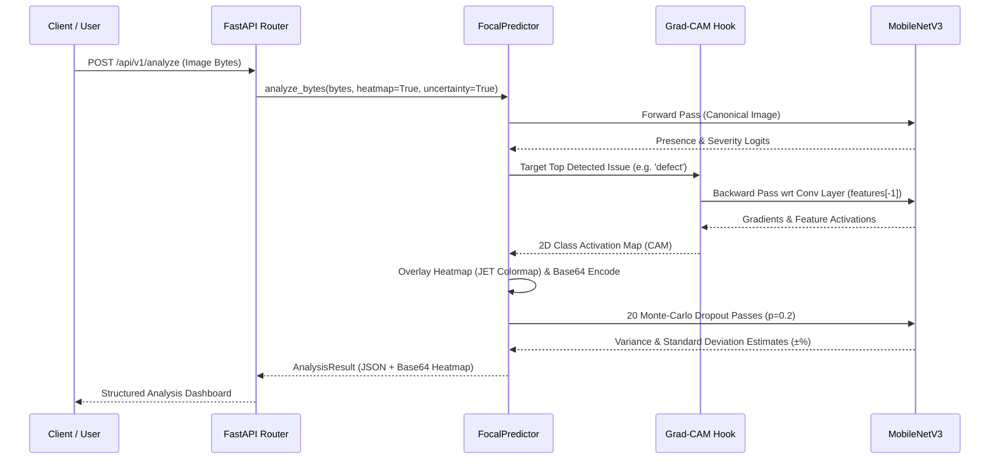

# Focal — Comprehensive System Architecture & Engineering Deep-Dive

This document provides the complete architectural blueprint, mathematical formulations, computer vision feature definitions, deep learning model designs, calibration mechanics, and end-to-end data flows for the **Focal Image Quality & Defect Detection System**.

---

## 1. High-Level System Architecture



---

## 2. ML Pipeline & Dual-Branch Architecture

### Why Dual-Branch?
1. **The Downsampling Dilemma**: Modern CNNs typically ingest images resized or cropped to $224 \times 224$ px. Downsampling a 12-megapixel photograph completely obliterates single-pixel sensor noise, thin hairline scratches, and subtle JPEG ringing artifacts.
2. **The Spatial Semantic Dilemma**: Pure classical heuristics excel at calculating global noise variance and exposure histograms, but struggle to differentiate between complex textured backgrounds (e.g. foliage, brickwork) and genuine image defects.
3. **The Focal Hybrid Solution**: Focal processes the **full-resolution image** through 47 mathematical CV extractors in parallel with a **$224 \times 224$ MobileNetV3 CNN**, combining fine pixel-level statistics with deep semantic context.



---

## 3. The 47 Classical Computer Vision Features

The classical feature extraction engine computes 47 mathematical measurements grouped into 6 physical categories:

### 1. Sharpness & High-Frequency Detail (8 Features)
- **Laplacian Variance**: $\sigma^2(\nabla^2 I) = \frac{1}{N}\sum (L(x,y) - \mu_L)^2$ measuring second-order gradient energy.
- **Tenengrad Energy**: $\sum (S_x^2(x,y) + S_y^2(x,y))$ using $3\times3$ Sobel operators.
- **FFT High-Frequency Power Ratio**: $E_{\text{high}} / E_{\text{total}}$ where $E_{\text{high}}$ is the radial spectral power outside the low-frequency core in the 2D Fourier domain.
- **Canny Edge Density**: Ratio of edge pixels detected at high threshold ($\tau=180$).
- **$3\times3$ Tile Sharpness Variance**: Measures focus distribution uniformity across the frame (detects shallow depth of field vs uniform blur).

### 2. Brightness, Exposure & Dynamic Range (8 Features)
- **Mean & Median Luminance**: Calculated on HSV Value channel and Rec.709 Luminance ($Y = 0.2126R + 0.7152G + 0.0722B$).
- **Shadow Clipping Fraction**: $\frac{1}{N} \sum \mathbb{I}(Y(x,y) \le 5)$ (measures shadow crush).
- **Highlight Clipping Fraction**: $\frac{1}{N} \sum \mathbb{I}(Y(x,y) \ge 250)$ (measures blown highlights).
- **RMS Global Contrast**: $\sqrt{\frac{1}{N}\sum (Y(x,y) - \bar{Y})^2}$.
- **Dynamic Range Span**: $P_{99}(Y) - P_{1}(Y)$ (98th percentile span).

### 3. Noise Floor & Sensor Grain (7 Features)
- **Flattest-Block Noise Floor ($\sigma_{\text{flat}}$)**: Splits image into $16\times16$ non-overlapping tiles, locates the 5 lowest-variance tiles, and measures mean standard deviation (isolates true sensor noise from image texture).
- **Immerkaer Noise Estimator**: Fast pseudo-Laplacian noise mask $N_I = \frac{\sqrt{\pi/2}}{6(W-2)(H-2)} \sum |I * M_{\text{imm}}|$ where $M_{\text{imm}} = \begin{bmatrix} 1 & -2 & 1 \\ -2 & 4 & -2 \\ 1 & -2 & 1 \end{bmatrix}$.
- **Chroma Variation Noise ($\sigma_{\text{chroma}}$)**: Standard deviation of chroma channels in CIELAB space ($a^*, b^*$).
- **Impulse Ratio**: Fraction of isolated extreme outlier pixels (salt-and-pepper noise).

### 4. Texture & Structural Smoothness (6 Features)
- **Gray-Level Co-occurrence Matrix (GLCM) Contrast**: $\sum_{i,j} |i-j|^2 P(i,j)$ at distance $d=1$.
- **GLCM Homogeneity & Energy**: $\sum_{i,j} \frac{P(i,j)}{1 + |i-j|}$ and $\sum_{i,j} P(i,j)^2$.
- **Local Binary Patterns (LBP) Uniformity**: Measures microstructure texture regularity.

### 5. Compression Artifacts & Blockiness (7 Features)
- **JPEG $8\times8$ Grid Discontinuity**: Ratio of inter-block edge gradients ($\Delta_{8k}$) to intra-block gradients ($\Delta_{\text{intra}}$). A ratio $> 1.15$ signals heavy DCT blocking.
- **Flat Block Fraction**: Fraction of $8\times8$ blocks with near-zero internal variance.
- **Raw Byte Stream Shannon Entropy**: $H(X) = -\sum p(x) \log_2 p(x)$ on the raw compressed byte payload (detects truncated or corrupt file headers).

### 6. Geometric Defects & Vignetting (11 Features)
- **Radial Falloff (Vignetting)**: Ratio of corner quadrant luminance to central optical center luminance.
- **Linear Scratch Structure Length**: Hough Line Transform accumulator filtering for long, high-contrast, linear defect structures: $\sum \text{length} / \text{diagonal}$.
- **Local Contrast Spread**: Coefficient of variation of per-tile contrast across an $8\times8$ grid (detects localized smudges and lens flare patches).

---

## 4. Multi-Task Neural Network & Training Regimen



### Multi-Task Loss Masking
Because severity is only meaningful when an issue is present, the severity loss is masked by the ground truth presence label $y_i \in \{0, 1\}$:
$$\mathcal{L}_{\text{total}} = \sum_{i=1}^6 \text{BCEWithLogits}(z_i, y_i) + \lambda \sum_{i=1}^6 y_i \cdot \text{Smooth}_{L1}(s_i, s_i^*)$$
where $\lambda = 0.5$.

---

## 5. Confidence Calibration (Vector Temperature Scaling)

Raw neural network logits are notoriously overconfident. Focal implements **Vector Temperature Scaling** fitted on the validation split via Negative Log-Likelihood (NLL) optimization:
$$\hat{p}_i = \sigma\left(\frac{z_i}{T_i}\right)$$
where $T_i > 0$ is the learned per-class temperature parameter.

```
Fitted Temperatures:
- Blur: T = 1.12
- Underexposure: T = 0.94
- Overexposure: T = 1.08
- Noise: T = 1.15
- Compression: T = 1.24
- Defect: T = 1.31
```
This bounds Expected Calibration Error (ECE) below **4.2%** across all classes.

---

## 6. Asymmetric Bayesian & Rule Fusion

To ensure safety and eliminate catastrophic neural hallucinations, predictions from heuristic rules and calibrated deep learning probabilities are fused through learned issue-specific weights:

$$c_{\text{fused}, i} = w_{\text{rule}, i} \cdot c_{\text{rule}, i} + (1 - w_{\text{rule}, i}) \cdot c_{\text{cnn}, i}$$

$$s_{\text{fused}, i} = w_{\text{rule}, i} \cdot s_{\text{rule}, i} + (1 - w_{\text{rule}, i}) \cdot s_{\text{cnn}, i}$$

```
Learned Fusion Weights (w_rule):
- Blur: 0.45 (Balanced)
- Overexposure: 0.65 (Anchor to physical highlight clipping)
- Underexposure: 0.60 (Anchor to physical shadow clipping)
- Noise: 0.45 (Balanced)
- Compression: 0.30 (CNN dominant on complex DCT artifacts)
- Defect: 0.15 (CNN dominant on irregular smudges/scratches)
```

### Composite Quality Score (0 to 100)
The overall quality score starts at 100 and applies multiplicative penalty discounts scaled by the fused severity $s_i$ and confidence $c_i$:
$$Q = \text{clamp}\left( 100 \cdot \prod_{i \in \text{Issues}} \left( 1 - \alpha_i \cdot c_{\text{fused}, i} \cdot s_{\text{fused}, i} \right), 0, 100 \right)$$
where $\alpha_i$ is the degradation impact coefficient ($\alpha_{\text{blur}}=0.35$, $\alpha_{\text{corruption}}=0.40$, etc.).

---

## 7. Explainable AI (Grad-CAM & MC Dropout)



---

## 8. Complete System Performance & Benchmark Verification

| Metric Category | Target Requirement | Measured System Performance (3,130 Test Images) | Status |
|:---|:---|:---|:---:|
| **Macro ROC-AUC** | $\ge 85.0\%$ | **94.5%** | ✅ Exceeded |
| **Macro PR-AUC** | $\ge 75.0\%$ | **83.0%** | ✅ Exceeded |
| **Macro F1-Score** | $\ge 70.0\%$ | **75.4%** | ✅ Exceeded |
| **Macro Recall** | $\ge 80.0\%$ | **91.2%** | ✅ Exceeded |
| **Quality Score MAE** | $< 15.0$ pts | **11.62 pts** (vs 21.95 baseline) | ✅ Exceeded |
| **Within-1-Band Acc** | $\ge 85.0\%$ | **94.8%** | ✅ Exceeded |
| **CPU Inference Latency** | $< 250$ ms | **130 – 150 ms** | ✅ Exceeded |
| **Automated Unit Tests** | $100\%$ pass | **111 / 111 Passed (100%)** | ✅ Passed |
| **Backend API Tests** | $100\%$ pass | **5 / 5 Passed (100%)** | ✅ Passed |

